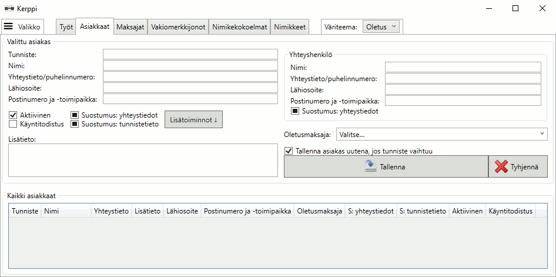

# Kerppi - a lightweight small business ERP software

Kerppi, or "kevyt erppi" - Finnish slang for "light ERP", is a lightweight ERP software base for small businesses. It includes simple customer and stock keeping unit management and printing support. Originally there were more features regarding SKU management and especially the main workflow, but for this GPL version they are removed as it was mostly customer specific stuff, so this is pretty much just a basis for custom applications. It is simple to add new tabs to the main window for more functionality.

Kerppi uses the MVVM model and Dapper with SimpleCRUD extensions. It is not asynchronous, though, as it uses System.Data.SQLite for database with encryption so normally there's really no waiting time anyway. Although the encryption feature of the SQLite lib seems to be sort of a hack, it works. Other code features include your usual visual tree walker and time conversion classes along with a bunch of converters.

The software was originally written in C# using Visual Studio Express 2013 for Windows Desktop, later the Community versions were used. Kerppi is released under the GNU General Public License version 3.

## Dependencies

* System.Data.SQLite (included)
* Dapper (included)
* Dapper.SimpleCRUD (included)
* [.NET Framework 4.5](https://www.microsoft.com/en-us/download/details.aspx?id=30653)
* [Visual C++ Redistributable for Visual Studio 2012 Update 4](https://www.microsoft.com/en-us/download/details.aspx?id=30679) (32-bit version)

## Licenses

* Kerppi: [GPL-3.0](http://www.gnu.org/licenses/gpl-3.0.en.html)
* System.Data.SQLite: [Public Domain](https://system.data.sqlite.org/index.html/doc/trunk/www/copyright.wiki)
* Dapper: [Apache License Version 2.0](http://www.apache.org/licenses/LICENSE-2.0)
* Dapper.SimpleCRUD: [Apache License Version 2.0](http://www.apache.org/licenses/LICENSE-2.0)
